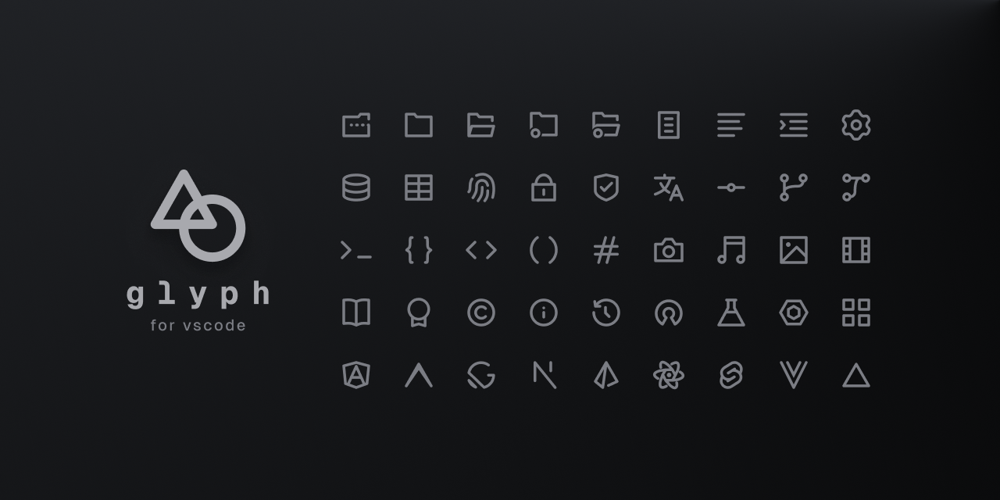

# Glyph for vscode

## Overview

After [**Spectrum Icons**](static/spectrum-legacy.png) was removed from
GitHub and the Visual Studio Marketplace, I meticulously crafted this icon theme
to be its successor.

The **Glyph for vscode** file icon theme provides highly customizable options
delivered in a minimalist package. These icons perfectly match the look of
Activity Bar items to make for a more cohesive-feeling experience.

## Features

- **Minimalistic design** - a simple icon set that stays true to the original
- **Multiple Icon Themes** - choose from a variety of icon themes, including
  legacy (the original set), minimal, and default (in color and monochrome
  variants)
- **Expanded Icon Set** - building on the icons from Spectrum, this theme
  introduces new icons for a broader range of file types

## Installation

<!-- TODO: Add alternative installation methods (e.g. vsix, cli, etc.) -->

1. Launch **Visual Studio Code**
1. Go to the **Extensions** view (<kbd>Ctrl</kbd> + <kbd>Shift</kbd> +
   <kbd>X</kbd> or <kbd>Cmd</kbd> + <kbd>Shift</kbd> + <kbd>X</kbd> on macOS)
1. Search for "Glyph for vscode".
1. Click on the **Install** button.
1. Once installed, click on the gear icon and select "Set File Icon Theme".
1. Chose any of the `glyph.*` options from the list.
1. Enjoy! :)

## Contributing

See [CONTRIBUTING.md](CONTRIBUTING.md) for details on how to contribute to this
project.

---

&copy; 2024-Present, **Glyph for vscode** is released under the
[MIT License](LICENSE.md) and is maintained by
[@lewxdev](https://github.com/lewxdev) and community contributors.

Special thanks to [@alexperronnet](https://github.com/alexperronnet), the
original creator of Spectrum Icons.
